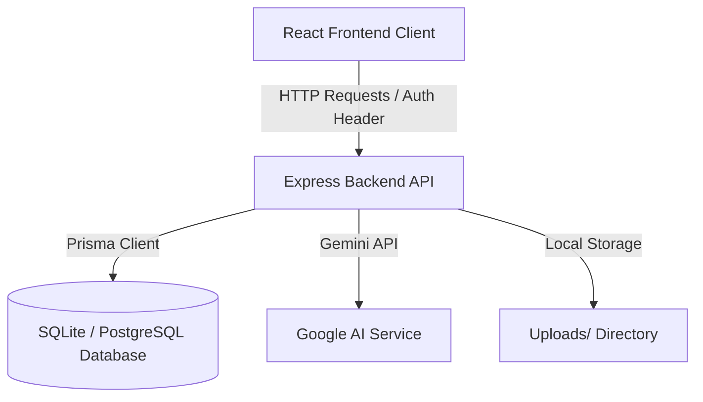

# Scout Pro – Dokumentacja Architektury Projektu

Platforma **Scout Pro** została zaimplementowana w architekturze typu monorepo z podziałem na część frontendową (kliencką) oraz backendową (serwerową/API). Baza danych jest zarządzana lokalnie za pomocą SQLite (z możliwością łatwego przełączenia na PostgreSQL) przy użyciu Prisma ORM.

---

## 1. Architektura Backend (Serwer API)

Serwer został napisany w technologii **Node.js** + **Express** + **TypeScript**. Kod źródłowy jest w pełni modularny, a struktura folderów wygląda następująco:
* `/src/index.ts` – Główny punkt startowy aplikacji (middleware, porty, rejestracja tras).
* `/src/middleware/auth.ts` – Middleware weryfikacji tokenów JWT oraz autoryzacji opartej o role (Guards).
* `/src/services/ai.ts` – Usługa integracji z Gemini AI (obsługa generowania opisów, potencjału, sugestii i porównań z lokalną logiką awaryjną - Mock Fallback).
* `/src/routes/` – Katalog zawierający kontrolery i endpointy REST API:
  * `auth.ts` – Rejestracja, logowanie użytkowników, hashowanie haseł (Bcrypt) i wydawanie JWT.
  * `players.ts` – Zarządzanie kartotekami piłkarzy, filtrowanie zaawansowane bazy, obsługa wgrywania zdjęć oraz klipów wideo (Multer).
  * `reports.ts` – Tworzenie raportów scoutingowych i koordynacja żądań generowania opinii przez model AI.
  * `watchlist.ts` – Obsługa listy obserwowanych graczy (Watchlist).
  * `notifications.ts` – Zarządzanie powiadomieniami o modyfikacjach profili.
  * `users.ts` – Zarządzanie uprawnieniami skautów przez administratora.

---

## 2. Architektura Frontend (Aplikacja Kliencka)

Aplikacja kliencka została zbudowana z użyciem **React** + **TypeScript** + **Vite** z pełną responsywnością i premium designem:
* **Brak zależności od ciężkich frameworków CSS**: Stylizacja opiera się w 100% o natywny system Vanilla CSS w pliku `/src/index.css`. Zapewnia to lekkość, wydajność i całkowitą kontrolę nad wyglądem.
* **Stylistyka Premium**: Zastosowano ciemny interfejs (Deep Slate), neonowe akcenty (Pitch Green/Mint `#00F59b`), elementy szklane (Glassmorphic cards) oraz mikrosekundowe animacje wejścia.
* **Routing stanowy**: Zastosowano lekki, natywny router sterowany stanem (state-driven routing), co eliminuje ryzyko problemów z ładowaniem ścieżek na serwerze i ułatwia natychmiastowe sprawdzanie sesji użytkownika.
* **Wizualizacje atrybutów**: Profil zawodnika generuje automatyczny pentagon parametrów piłkarskich za pomocą dedykowanego komponentu `RadarChart.tsx` opartego o wektorowy format SVG.
* **Generowanie PDF**: Zaimplementowano dedykowane style druku `@media print`, dzięki czemu przycisk eksportu PDF pozwala na wygenerowanie czystego, profesjonalnego dokumentu raportu z logiem, tabelami i opiniami AI bezpośrednio z poziomu przeglądarki bez obciążania serwera.

---

## 3. Schemat Bazy Danych (Prisma Models)

Baza danych zdefiniowana jest w `/backend/prisma/schema.prisma` i składa się z 6 powiązanych relacyjnie tabel:

1. **User**: Identyfikator skauta, email, hasło (hash), rola systemowa (`ADMIN`, `HEAD_SCOUT`, `SCOUT`). Relacja 1-do-wielu z raportami i powiadomieniami.
2. **Player**: Imię, nazwisko, wiek, klub, wzrost, preferowana noga, statystyki (technika, szybkość, fizyczność, kreatywność, mentalność w skali 1-20), zdjęcie. Relacja 1-do-wielu z raportami i nagraniami wideo.
3. **ScoutingReport**: Zapis z mocnymi i słabymi stronami gracza, rekomendacją (`SIGN`, `MONITOR`, `DISCARD`) oraz danymi wygenerowanymi przez Gemini AI.
4. **Watchlist**: Tabela łącząca relację wiele-do-wielu między użytkownikami a graczami (lista obserwowanych).
5. **Notification**: Powiadomienia generowane dla poszczególnych skautów o zmianach kadrowych lub nowych raportach.
6. **Video**: Odnośniki do plików wideo wgranych na serwer przypisanych do profili graczy.

---

## 4. Moduł AI i Heurystyki (Gemini API Integration)

Asystent AI analizuje wejściowe dane gracza na dwa sposoby:
1. **Z kluczem API (Gemini)**: Pobiera token `GEMINI_API_KEY`, tworzy sesję z modelem `gemini-1.5-flash` i na bazie szczegółowych promptów generuje naturalny opis taktyczny, porównuje zawodnika do prawdziwych gwiazd futbolu o takich samych statystykach oraz buduje spersonalizowaną ścieżkę rozwoju (wskazówki treningowe).
2. **Bez klucza API (Heurystyczny generator lokalny)**: Analizuje wartości parametrów (np. najwyższe cechy, wiek) i automatycznie składa profesjonalny, wieloaspektowy tekst w języku polskim. Gwarantuje to poprawne i imponujące działanie modułu AI natychmiast po uruchomieniu aplikacji, bez konieczności konfiguracji API.
